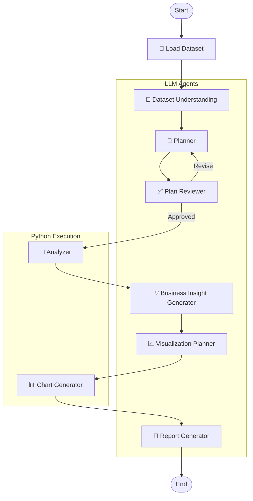

# 📊Data Analyst Agent

A weekend learning project built while exploring **Agentic AI** and **LangGraph**.

The goal was to understand how multiple AI agents can collaborate in a structured workflow to analyze a dataset instead of relying on a single LLM prompt. The project combines LLM reasoning with Python-based data analysis to generate business insights, visualizations, and a final report.

## 🚀 Features

- Dataset understanding
- Analysis planning & review
- Python-based data analysis
- Business insight generation
- Visualization planning
- Automatic chart generation
- Final business report

## 🛠️ Tech Stack

- Python
- LangGraph
- LangChain
- Groq
- Pandas
- Matplotlib
- Pydantic

## 🔄 Workflow

## 💡 What I Learned

- Building multi-agent workflows using LangGraph
- Separating LLM reasoning from deterministic Python execution
- Using structured outputs with Pydantic
- Designing modular AI pipelines
- Orchestrating multiple AI agents for a single task

## ⚠️ Limitations

This project is intended as a learning exercise and works best with structured CSV datasets. It is not designed to handle every possible dataset or edge case.

## 📌 Future Improvements

- Better validation of generated plans
- Support for more analysis types
- Interactive dashboard
- PDF report export

---

Built while learning **Agentic AI** and **LangGraph** 🚀

Note: This project was built over a weekend while learning Agentic AI and LangGraph. The goal was to understand how specialized LLM agents can collaborate with deterministic Python code to automate a complete data analysis workflow, rather than building a production-ready analytics platform.